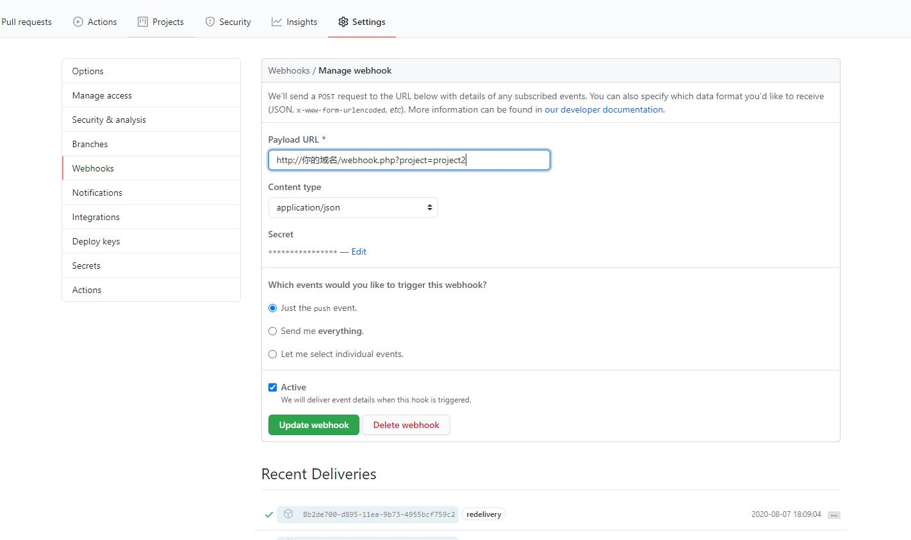

<p align="center">
  <a href="https://github.com/cyfx/webhook">
    
  </a>
  <p align="center">
    基于github/gitlab的webhook接收更新
    <!-- <br /> -->
    <!-- <a href="https://github.com/cyfx/webhook"><strong>Explore the docs »</strong></a> -->
    <!-- <br /> -->
    <br />
    <a href="https://github.com/cyfx/webhook">查看手册</a>
    ·
    <a href="https://github.com/cyfx/webhook/issues">报告错误</a>
    ·
    <a href="https://github.com/cyfx/webhook/issues">贡献代码</a>
  </p>
</p>


<!-- TABLE OF CONTENTS -->
## 目录

* [关于项目](#关于项目)
  * [背景](#背景)
  * [解决什么问题](#解决什么问题)
* [入门](#入门)
  * [先决条件](#先决条件)
  * [安装](#安装)
* [用法](#用法)
  * [调试](#调试)
* [产品规划](#产品规划)
* [贡献](#贡献)
* [License](#license)
* [捐赠](#捐赠)


<!-- ABOUT THE PROJECT -->
## 关于项目

### 背景

提交github的代码，每次都要手动pull到服务器，所以就使用github自带的webhooks功能

### 解决什么问题

1. 部署到服务器，当git有push时，服务器可以同步更新git代码。
2. 当有多个项目的时候，可以只部署一套webhook，多个项目共用这个代码


<!-- GETTING STARTED -->
## 入门

支持单项目git同步，或者多项目git同步
### 先决条件

1. 服务器已经安装好git环境，并配置好对应的git账号权限
2. php不能禁用`shell_exec`函数
3. 代码执行用户要有项目文件夹的更新权限，php_basedir要有权限

### 安装

1. 直接复制webhook.php，保存到项目目录/webhook.php
2. 修改代码里面keys的配置，默认是default, 把项目目录填写到path里面，secret是webhook加密的key, 建议一定要写，至少20位随机字符
```php
$keys = [
        'default' => [
            'path' => '/www/wwwroot/test',
            'secret' => ''
        ]
    ];
```
3. 如果是多项目更新，数组可以填写多个，只需要配置的webhook地址的时候，get传参数把project名称传递过来即可
```php
$keys = [
        'default' => [
            'path' => '/www/wwwroot/test',
            'secret' => ''
        ]，
        'project2' => [
            'path' => '',
            'secret' => ''
        ]，
    ];
```
4. 到github/gitlab配置webhooks
路径是setting > webhooks, 新建钩子。 Payload URL填写通知域名, 默认项目更新可以不用加project参数
```
http://你的域名/webhook.php?project=project2
```
通知触发一般`push`实践触发就行了。

**secret记得要配置和代码里面的一致**



5. 现在提交下git就会自动触发更新了。

<!-- USAGE EXAMPLES -->
## 用法

代码push到github/gitlab,就会触发webhooks,然后会触发webhook.php，执行git拉取命令。

### 调试

github提供最近提交的事件细节，可以进入钩子详情，查看github请求头和body参数，以及请求响应。更新错误的时候，可以通过重发事件请求，来重现bug。


<!-- ROADMAP -->
## 产品规划

### thinkphp
增加thinkphp5.1集成版本


<!-- CONTRIBUTING -->
## 贡献
[@cyfx](https://github.com/cyfx)


<!-- LICENSE -->
## License

The code for Payment is distributed under the terms of the MIT license (see [LICENSE](LICENSE)).


<!-- CONTACT -->
## 联系我们


<!-- ACKNOWLEDGEMENTS -->
## 致谢


## 捐赠
如果你觉得这个项目有用，你可以给作者买一杯果汁🍹

